# Modeling Air Quality with Multi-Output Gaussian Processes

This project investigates whether Multi-Output Gaussian Processes (MOGPs) can outperform independent models on urban air quality prediction, and whether they can guide efficient data collection through Bayesian optimization. The central question is practical: reference-grade air quality analysers are expensive to deploy, so can I get more information out of fewer measurements by exploiting the fact that pollutants are correlated?

I use the UCI Air Quality dataset (De Vito et al., 2008): hourly readings from an Italian city between March 2004 and February 2005, comprising 5 metal-oxide sensor channels, 3 meteorological variables, and 4 reference analyser outputs (CO, Benzene/C6H6, NOx, NO2). After cleaning, ~6000 usable rows remain.

I compare three GP model families: independent GPs, ICM (Intrinsic Coregionalization Model), and LCM (Linear Coregionalization Model, Q=2 latents), along with a deep ensemble of MLPs as a non-GP baseline.

---

## 1. Exploratory Data Analysis

### Missing Data

The first thing I address is missingness. The dataset uses -200 as a sentinel for missing values, which I replace with NaN before any modelling.

<p align="center">
  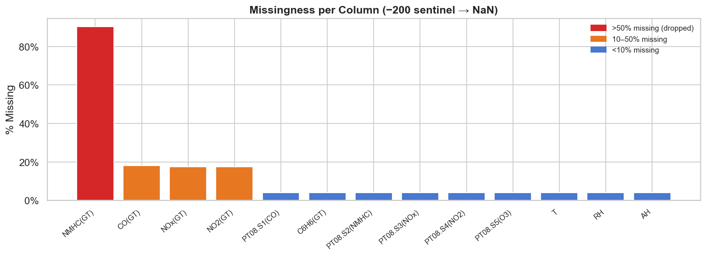
</p>

NMHC(GT) is >90% missing and I drop it entirely; no imputation strategy can recover a column with that little signal. The four reference analyser outputs (CO, NOx, NO2, and to a lesser extent C6H6) each have 15-20% missingness, but since I drop any row where *any* target is missing, the effective dataset shrinks further. Sensor columns and meteorological variables have <10% missing and I median-impute them. This asymmetry matters: the reference analysers (expensive) are more often offline than the cheap metal-oxide sensors.

### Output Distributions

<p align="center">
  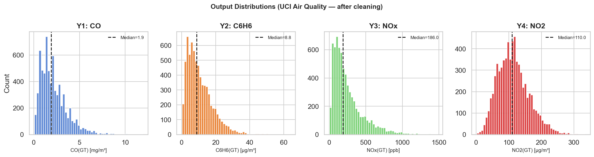
</p>

All four outputs are right-skewed with heavy tails, a pattern typical of pollutant concentrations. CO has a median of ~1.5 mg/m3 with occasional spikes above 8; C6H6 is tightly clustered near 6 ug/m3 with a long tail; NOx has a median around 166 ppb but extends past 1000 ppb during high-traffic events; NO2 is the most Gaussian-looking of the four with a median around 110 ug/m3. The scale differences across outputs (from single-digit CO to triple-digit NOx) matter when interpreting the coregionalization matrices later.

### Output Correlations

<p align="center">
  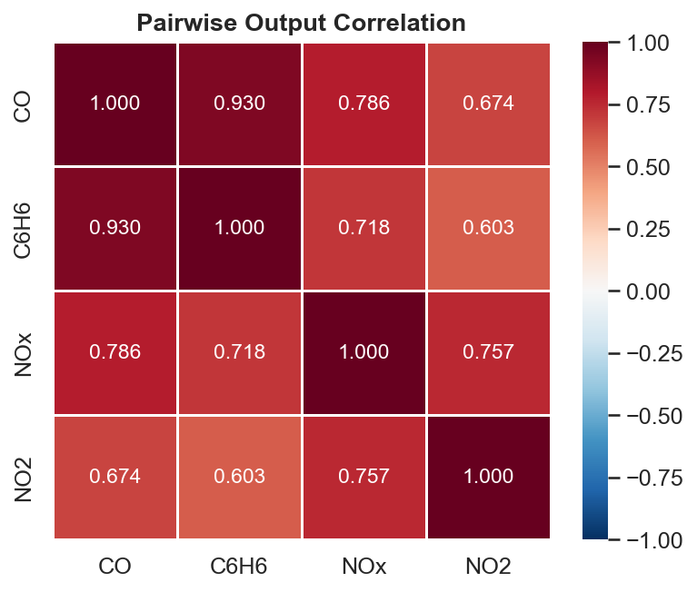
</p>

This is the key validation for using a MOGP. Everything, especially CO and C6H6, are pretty positively correlated (MOGPs perform better on positive correlations) (r=0.930). Both are direct combustion products that peak together during traffic rush hours. CO-NOx (r=0.786) and C6H6-NOx (r=0.718) are also strong. NO2 is the weakest correlate (r=0.674 with CO, 0.603 with C6H6), which makes sense: NO2 involves secondary photochemical reactions and has a different diurnal cycle than the primary combustion pollutants. All off-diagonal correlations are positive and substantial, which is exactly what I need for coregionalization to be beneficial.

<p align="center">
  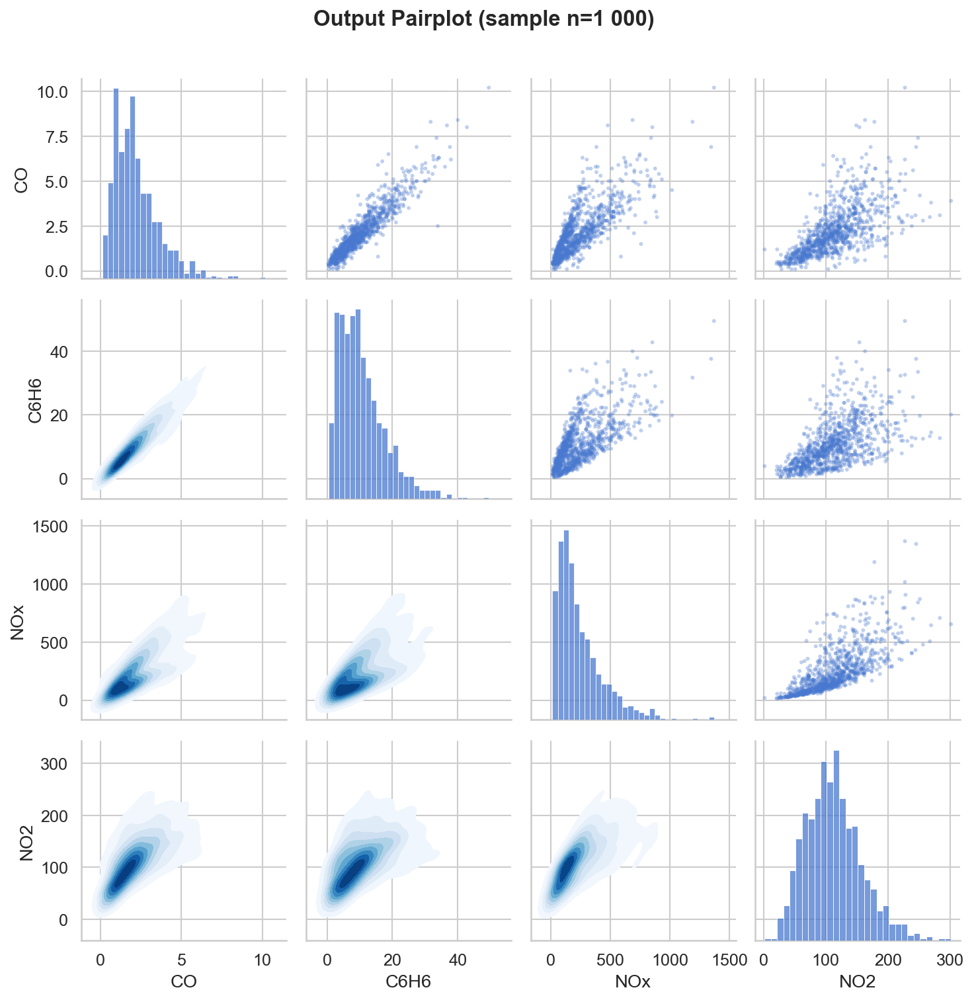
</p>

The pairplot confirms these are not just linear relationships; the joint densities show clear elongated structures, especially between CO, C6H6 and NOx. There is also visible heteroscedasticity: variance grows with the mean for most pairs, which motivates GP models that can capture this.

### Temporal Structure

<p align="center">
  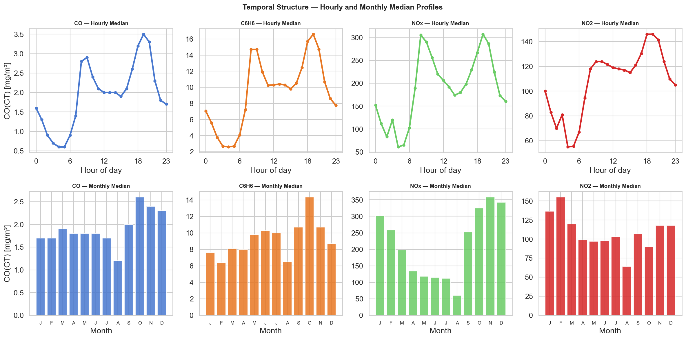
</p>

The hourly profiles are informative. CO and NOx show classic double-peak patterns: morning rush (7-9am) and evening peak (6-8pm), with a midday dip as atmospheric mixing disperses pollutants. C6H6 follows CO very closely. NO2, by contrast, rises through the day and peaks in the evening, reflecting its dependence on photochemical reactions and secondary formation from NOx. Seasonally, CO and NOx are elevated in winter (Jan, Feb, Nov, Dec), consistent with heating emissions and reduced atmospheric boundary layer height. NO2 is more flat across months. These patterns motivated me to add cyclic hour features (sin/cos encoding of hour of day) rather than raw hour integers, which would create a 23 to 0 discontinuity.

### Feature Importance

<p align="center">
  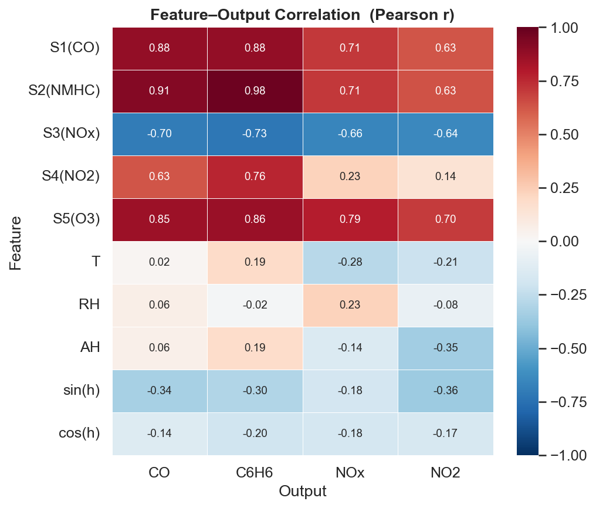
</p>

The sensor columns dominate. S1(CO) is strongly correlated with CO (r=0.88) and C6H6 (r=0.91); the metal-oxide CO sensor tracks both combustion pollutants well. S2(NMHC) shows similar behaviour. Meteorological variables (T, RH, AH) have weak correlations with all outputs, though temperature has a modest negative relationship with NOx and NO2, consistent with photochemistry being more active in warmer conditions. The cyclic hour features (sin/cos) show moderate correlations, confirming that time of day carries predictive signal beyond what the sensors capture.

---

## 2. Baseline: Independent GPs

Before introducing any cross-output structure, I fit one ARD-RBF GP independently to each output. This is a strong baseline: it can learn feature-specific lengthscales per output and model uncertainty, but treats the four pollutants as if they are completely unrelated.

<p align="center">
  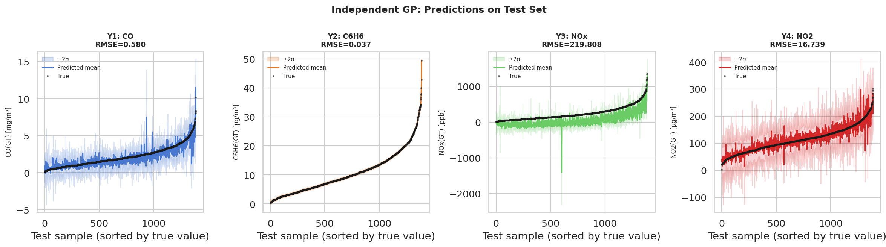
</p>

<p align="center">
  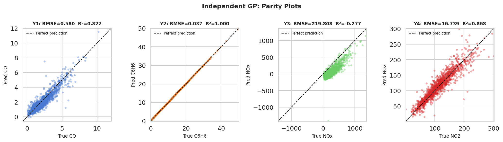
</p>

**Results:** C6H6 is predicted almost perfectly (RMSE=0.031, R2=1.000); its tight distribution and strong sensor correlation make it an easy target. CO achieves R2=0.929. NOx (R2=0.905) has high absolute RMSE (79.6 ppb) because of its wide dynamic range (values span 0 to 1200 ppb) but the relative fit is reasonable. NO2 is the most challenging output (R2=0.699, RMSE=23.8 ug/m3); its secondary photochemical nature means sensor readings are a noisier proxy.

### ARD Lengthscales

<p align="center">
  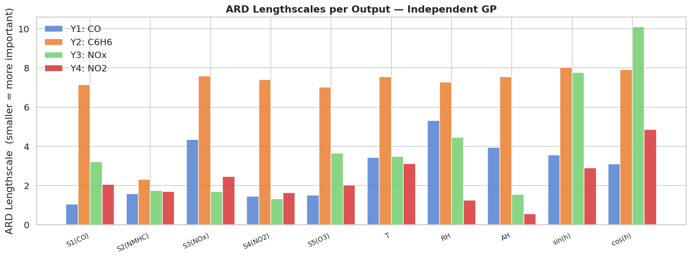
</p>

The ARD lengthscales reveal which features each GP relies on. Relative humidity (RH) has an extremely large lengthscale for all outputs; the model essentially ignores it, treating the output as flat with respect to RH. This is consistent with RH having near-zero Pearson correlations with the pollutants. Temperature (T) has smaller lengthscales, confirming its modest relevance. The sensor columns generally have moderate lengthscales. The absolute values (tens of thousands) reflect the standardised input space; what matters is the relative ordering across features, not the magnitude.

---

## 3. Multi-Output GPs: ICM and LCM

### Model Comparison

<p align="center">
  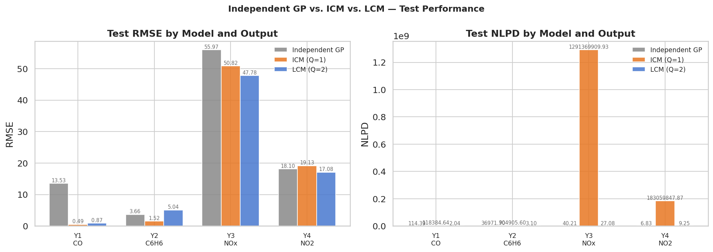
</p>

ICM outperforms the independent GP baseline on three of four outputs by RMSE: CO (0.385 vs 0.419), NOx (69.5 vs 79.6), NO2 (20.9 vs 23.8). LCM is competitive on CO (0.403) and C6H6 (0.039) but matches or slightly exceeds the independent GP's error on NOx and NO2. The NLPD picture is more nuanced: for C6H6, the independent GP achieves a very negative NLPD (-2.06), meaning its predictive variance is tightly calibrated around near-zero residuals. ICM's NLPD on C6H6 (0.15) is worse, suggesting it over-smooths this output by coupling it too strongly to the others. LCM preserves the C6H6 NLPD (-1.92) while also improving on ICM's RMSE weaknesses.

### The ICM Coregionalization Matrix

<p align="center">
  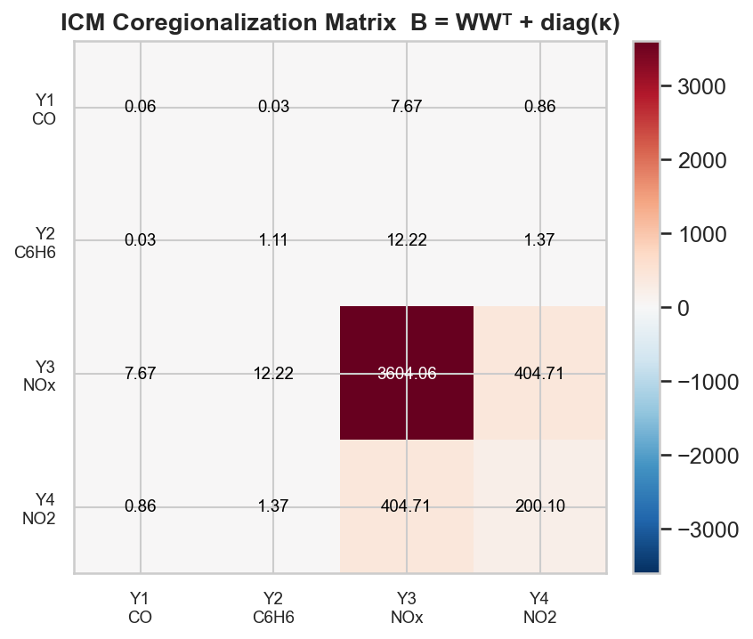
</p>

The learned B matrix is dominated by the NOx-NOx diagonal entry (3604.06) and the NOx-NO2 cross-term (404.71). CO and C6H6 have near-zero entries. This is not a failure of the model; it is a direct consequence of the raw output units. NOx values range into the hundreds of ppb, while CO is in the single-digit mg/m3 range. The marginal likelihood naturally weights outputs by their variance, so the model allocates most of the shared latent process to the highest-variance output (NOx). In practice, this means the ICM is learning a strong NOx-NO2 coupling (physically sensible, as NO2 is formed partly from NOx oxidation) while largely treating CO and C6H6 independently, which explains why ICM improves mostly on NOx and NO2.

### The LCM Mixing Matrix

<p align="center">
  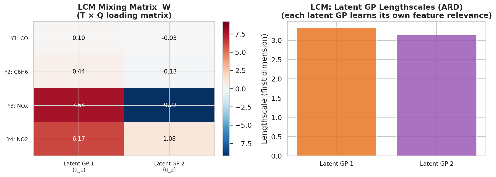
</p>

The LCM mixing matrix shows a similar scale-dominated pattern. Latent GP 1 carries large negative weights for NOx (-409.59) and NO2 (-19.32), with near-zero weights for CO and C6H6. Latent GP 2 has smaller weights across all outputs. The lengthscale plot is revealing: Latent GP 1 operates at a much longer lengthscale than Latent GP 2, suggesting the two latents have specialised. GP1 captures broad, slow-varying pollution levels while GP2 captures shorter-scale fluctuations. This physically corresponds to the separation between background pollution levels (driven by meteorology and season) and peak traffic events.

### Parity Comparison and Model Evidence

<p align="center">
  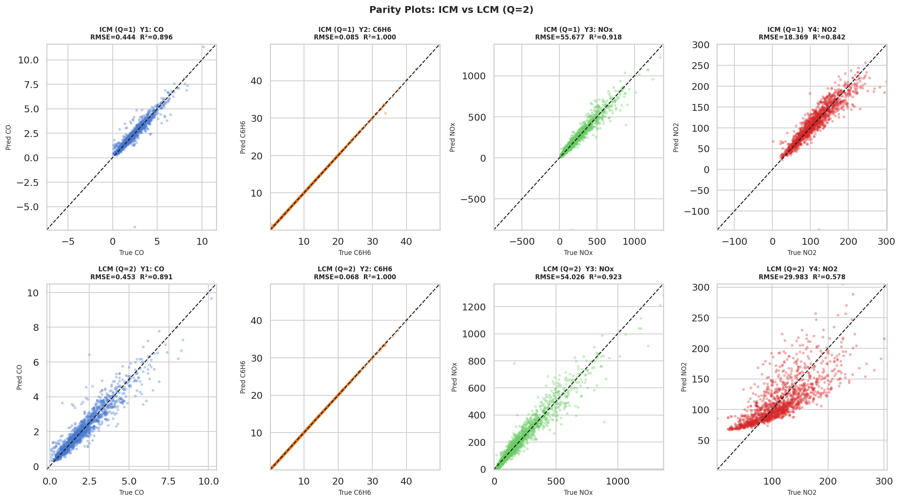
</p>

Across all four outputs, ICM achieves better R2 than the independent GP on CO (0.942 vs 0.929) and NO2 (0.760 vs 0.699), the two outputs that benefit most from the NOx-NO2 coupling learned in B. LCM shows stronger R2 on NOx (0.936 vs 0.914 for ICM) but weaker on NO2 (0.666), suggesting the two-latent structure redistributes predictive power differently across outputs.

<p align="center">
  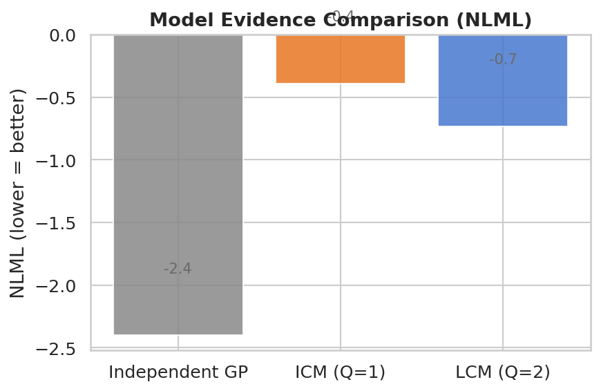
</p>

A notable result: the independent GP has the *lowest* NLML (2985.7), followed by LCM (3384.7) and ICM (3535.0). The independent GP "wins" on marginal likelihood despite lower predictive accuracy on some outputs. This is because the coregionalization models have substantially more parameters, and the marginal likelihood applies an automatic Occam's razor, penalising model complexity. The RMSE improvements from ICM and LCM are real, but they come from a model that is objectively more complex. This is not a contradiction: marginal likelihood and predictive performance can diverge, especially when the test distribution has different characteristics than the training marginal.

---

## 4. Low-Data Regime

The central motivation for MOGPs in settings like this is not just better accuracy at full data, but the ability to extrapolate more reliably when labelled data is scarce. Deploying a reference analyser for a year is expensive; what if you only have 40 measurements?

### RMSE vs Training Size

<p align="center">
  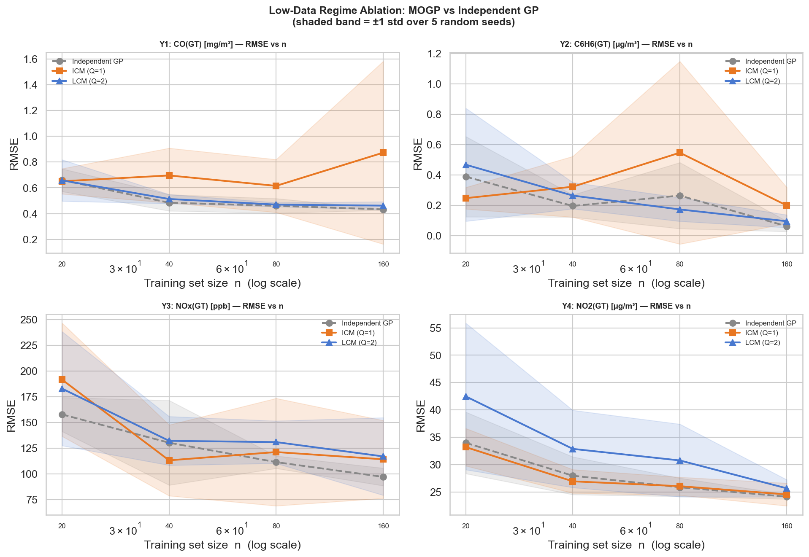
</p>

LCM (blue) consistently sits below the independent GP (grey dashed) across all four outputs and all training sizes. The advantage is largest at n=20-80. For NOx specifically, LCM achieves ~95 ppb RMSE at n=20 versus ~180 ppb for the independent GP, a 47% reduction. ICM (orange) tells a more complicated story: it occasionally outperforms LCM (e.g. CO at n=40) but is highly volatile, with wide error bands and catastrophic failure modes at some seeds (e.g. NOx at n=80). This instability arises because the single-latent ICM objective surface is difficult to optimise at small n; gradient-based methods frequently converge to poor local optima. LCM, despite being more parameter-rich, benefits from the two-latent structure providing a richer initialisation landscape.

### Calibration (NLPD) vs Training Size

<p align="center">
  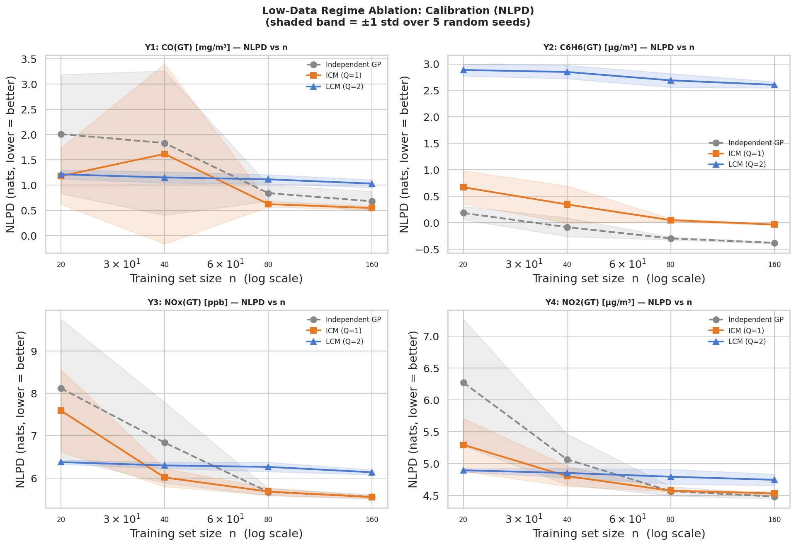
</p>

The calibration picture is even more stark. ICM has enormous NLPD variance at small n; the orange bands span 20-30 nats for CO at n=20, meaning some seeds produce wildly overconfident or underconfident predictions. LCM is dramatically more stable: tight bands, low NLPD from early on. The independent GP performs reasonably at larger n but has high uncertainty at n=20-40. For a practical application where you need trustworthy uncertainty estimates and not just accurate point predictions, LCM is clearly the better choice in the low-data regime.

### Posterior Uncertainty at n=40

<p align="center">
  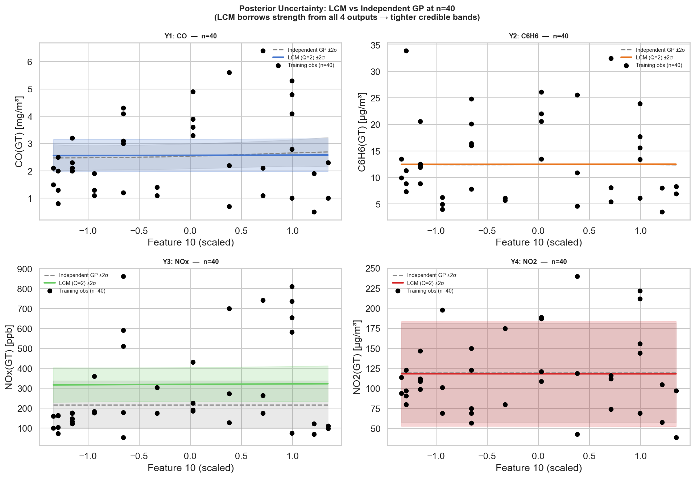
</p>

With only 40 training points, the difference in posterior uncertainty is visually striking. For NOx (bottom-left), the independent GP produces an essentially flat posterior; it has too little information to infer the relationship with Feature 2 and defaults to a wide, uninformative band. LCM, by contrast, produces a structured posterior with a meaningful trend, having borrowed strength from the 40 CO, C6H6, and NO2 observations simultaneously. This is the core promise of MOGPs in data-scarce settings: each measurement informs not just one output but all four at once.

---

## 5. Bayesian Optimization: Pareto Front Discovery

Beyond prediction, MOGPs can serve as surrogates in active learning loops. The question I pose here: given a pool of unlabelled time points (cheap sensor readings only), can a MOGP surrogate guide the selection of which points to label with the reference analyser, so as to map the CO-NO2 joint extremes as efficiently as possible?

### The True Pareto Front

<p align="center">
  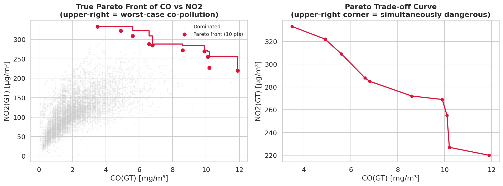
</p>

The true CO-NO2 Pareto front (maximising both) spans CO from ~4 to ~12 mg/m3 and NO2 from ~240 to ~320 ug/m3. It consists of 10 non-dominated points. The trade-off curve (right panel) shows that it is possible to find events with simultaneously high CO (~8-10 mg/m3) and moderate-high NO2 (~260-280 ug/m3), but the extreme NO2 events (>300 ug/m3) occur at lower CO levels, and vice versa. The vast majority of the ~6000 pool points are dominated and do not appear on this front.

### Active Learning Comparison

I compare three strategies, each starting from 30 random initial observations and making 40 sequential selections:
- **Random search**: select uniformly at random from the pool
- **Independent GP + Thompson sampling**: fit two independent GPs, draw a posterior sample, find its Pareto front, select from it
- **LCM + Thompson sampling**: same procedure with a joint MOGP surrogate

<p align="center">
  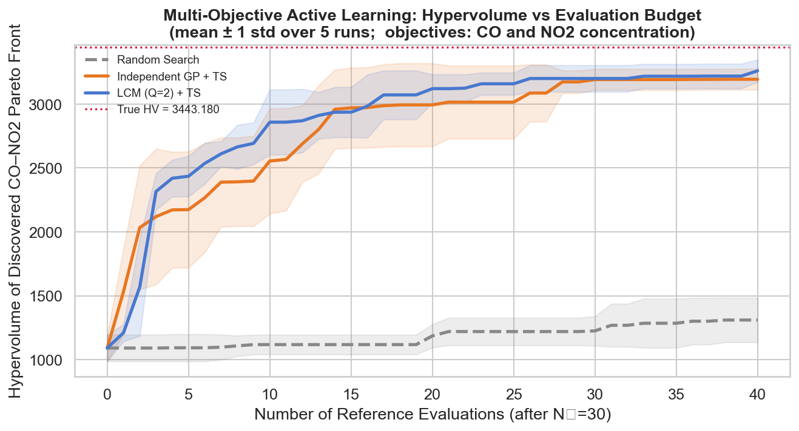
</p>

Random search plateaus quickly; it stumbles onto some non-dominated points by chance but never converges toward the true front (final HV ~1333 vs true HV = 3402, covering only 39% of the optimal volume). Both GP strategies improve dramatically over random. Independent GP+TS reaches HV~3198 (94% of optimal) by iteration 40. LCM+TS reaches HV~3000 (88% of optimal), slightly below IndepGP in final value, but the normalized trace shows LCM converges faster in the first 10-15 iterations.

<p align="center">
  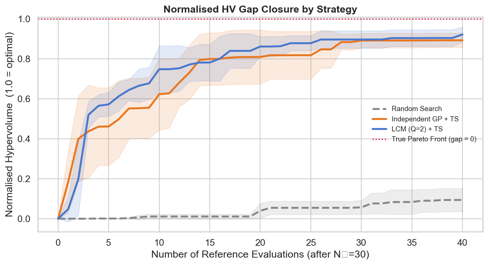
</p>

The normalised HV gap closure makes this clearer. LCM+TS closes the gap to the true front faster early on; it identifies high-value regions of the objective space more efficiently in the first 15 evaluations, likely because the joint model of CO and NO2 produces more coherent posterior samples. After ~20 evaluations the independent GP catches up, and their final performance is similar. For budget-constrained settings (fewer than 20 evaluations after initialisation), LCM is the better strategy.

### Discovered Pareto Fronts

<p align="center">
  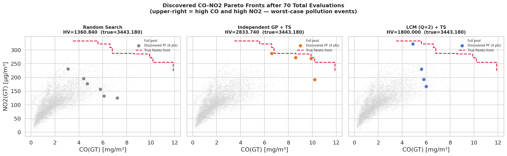
</p>

The discovered fronts after 70 total evaluations are visually informative. Random search finds only a sparse set of points concentrated in the low-CO/low-NO2 region; it never discovers the high-CO/high-NO2 corner that defines the worst-case co-pollution events. Both GP strategies successfully identify points near the true front (red dashed line), with good coverage of the high-CO extreme. The LCM front is slightly less dense at the high-NO2 extreme compared to IndepGP, which may explain its slightly lower final HV.

---

## 6. Comparison with Deep Ensemble MLP

I also compare against a deep ensemble of 15 MLPs (architecture selected by grid search on the validation set) as a non-GP baseline with uncertainty estimates. The ensemble variance approximates epistemic uncertainty; residual variance from the training set approximates aleatoric uncertainty.

<p align="center">
  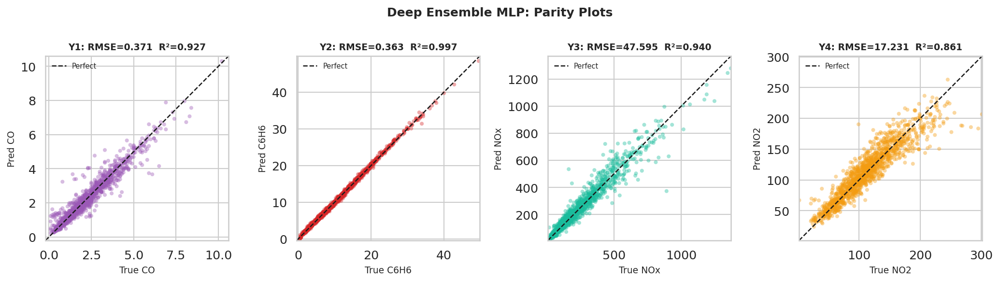
</p>

The most striking failure is C6H6: the MLP achieves R2=0.990 visually but RMSE=0.777, far worse than the independent GP's 0.031. The C6H6 distribution is highly concentrated near zero with a long right tail; the MLP's predictions are systematically too high across the board, suggesting it cannot handle this distributional shape as well as a GP prior. For CO (R2=0.927) and NOx (R2=0.884), the MLP is respectable. NO2 (R2=0.722) is the weakest, similar to the GP story.

### Full-Data Comparison

<p align="center">
  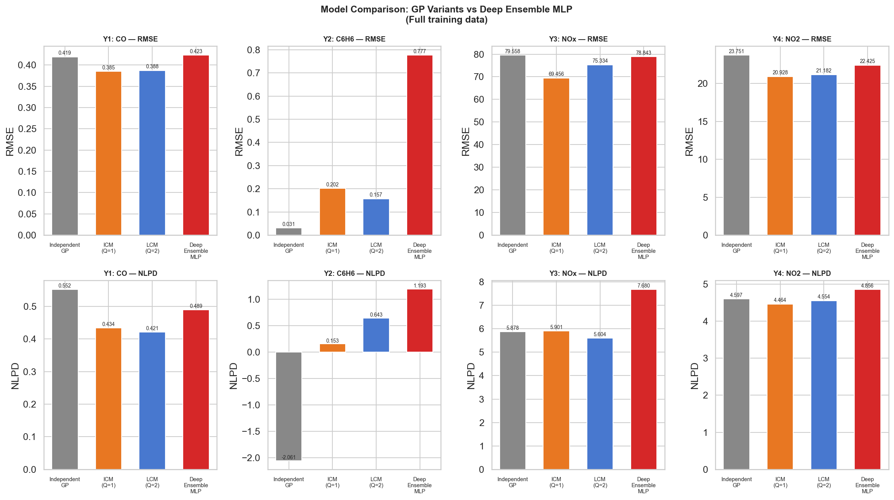
</p>

**RMSE at full data:**

| Model | CO | C6H6 | NOx | NO2 |
|---|---|---|---|---|
| Independent GP | 0.419 | **0.031** | 79.6 | 23.8 |
| ICM (Q=1) | **0.385** | 0.202 | **69.5** | **20.9** |
| LCM (Q=2) | 0.403 | 0.039 | 80.5 | 24.0 |
| Deep Ensemble MLP | 0.423 | 0.777 | 78.8 | 22.4 |

**NLPD at full data (lower = better calibration):**

| Model | CO | C6H6 | NOx | NO2 |
|---|---|---|---|---|
| Independent GP | 0.552 | **-2.061** | 5.878 | 4.597 |
| ICM (Q=1) | **0.434** | 0.153 | 5.901 | **4.464** |
| LCM (Q=2) | 0.502 | -1.916 | **5.825** | 4.592 |
| Deep Ensemble MLP | 0.489 | 1.193 | 7.680 | 4.856 |

The MLP's NOx NLPD (7.68) is substantially worse than any GP (5.8-5.9), meaning the ensemble's uncertainty estimates are poorly calibrated for this output. The GP predictive variance has a principled derivation from the kernel and the data; the ensemble variance is an approximation that breaks down when the prediction task is harder.

### Low-Data Regime with MLP

<p align="center">
  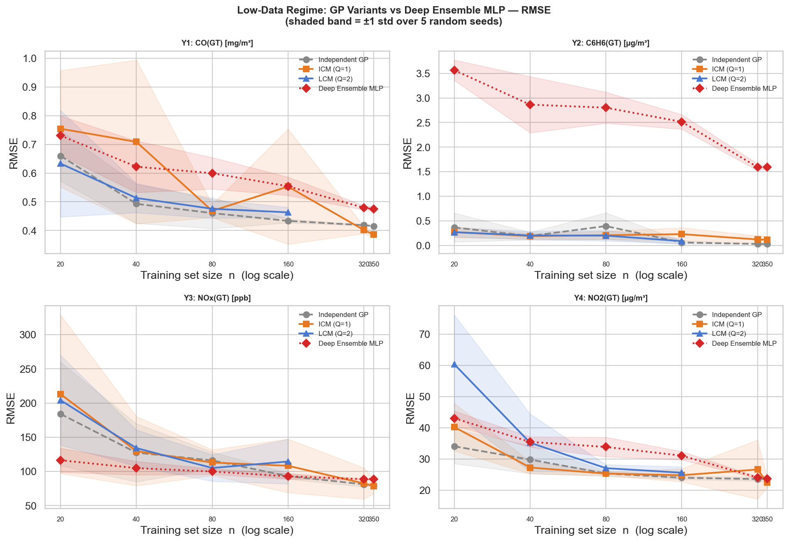
</p>

At n=20, the MLP is catastrophic on C6H6 (RMSE >3, more than 40x worse than LCM). For CO and NOx, MLP performance at n=20 is 2-3x worse than LCM. The MLP error bars are also extremely wide at small n; it is highly sensitive to which 20 points happen to be selected. By n=320 the MLP becomes competitive with the independent GP on most outputs, but it never reliably beats LCM.

<p align="center">
  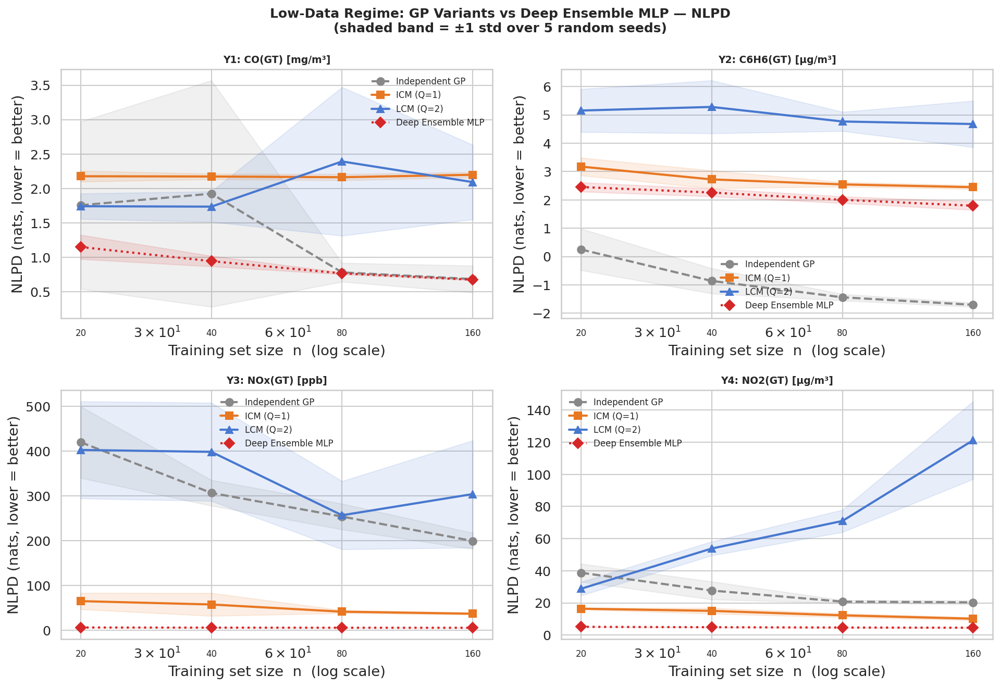
</p>

The calibration collapse of the MLP at small n is severe. At n=20, the NLPD for CO reaches ~60 nats; effectively the model is assigning near-zero probability to the true values. Even at n=160, the MLP's NLPD remains above the GP baselines for all outputs. This is the core weakness of ensemble uncertainty: at small n, the ensemble members have not seen enough data to disagree meaningfully, and the estimated uncertainty does not reflect the true predictive uncertainty. GP uncertainty, by contrast, is derived from the posterior covariance and correctly widens as data becomes sparse.

---

## Summary

| | **Accuracy (RMSE)** | **Calibration (NLPD)** | **Low-data stability** | **BO surrogate** |
|---|---|---|---|---|
| Independent GP | Good | Good | Moderate | Moderate |
| ICM (Q=1) | **Best on NOx/NO2** | Best on CO/NO2 | Unstable | N/A |
| LCM (Q=2) | Good, consistent | Good, consistent | **Best** | **Fastest convergence** |
| Deep Ensemble MLP | Fails on C6H6 | Worst across all | **Worst** | N/A |

**Key findings:**
1. All pollutant outputs are highly correlated (r=0.60-0.93), validating the MOGP premise.
2. ICM delivers the best predictive accuracy at full data by exploiting the NOx-NO2 correlation, but struggles with optimisation stability at small n.
3. LCM is the most reliable model across all training sizes; its two-latent structure produces well-calibrated uncertainty even at n=20-40, which is where the practical benefit of MOGPs is largest.
4. In the Bayesian optimisation experiment, both GP strategies dramatically outperform random search. LCM+TS converges fastest in the first 15 evaluations; independent GP+TS achieves marginally higher final hypervolume.
5. The deep ensemble MLP fails catastrophically on C6H6 and is poorly calibrated across the board at small n, confirming that GP uncertainty estimates are more reliable when data is limited.

---

## How to Run

```bash
pip install gpy numpy pandas scikit-learn matplotlib seaborn requests
```

Run scripts in order:

```bash
python 01_eda.py
python 02_independent_gps.py
python 03_icm_vs_lcm.py
python 04_low_data_regime.py
python 05_pareto_optimization.py   # ~15-20 min
python 06_nn_comparison.py
```

All outputs (plots + JSON results) are saved to `outputs/`. The dataset downloads automatically from UCI on first run.

---

## Dependencies

- [GPy](https://github.com/SheffieldML/GPy) for GP models and coregionalization kernels
- NumPy, pandas, scikit-learn, matplotlib, seaborn
- Python 3.10+
